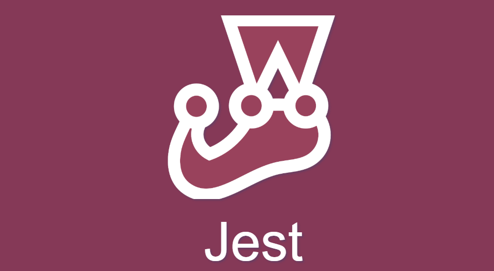
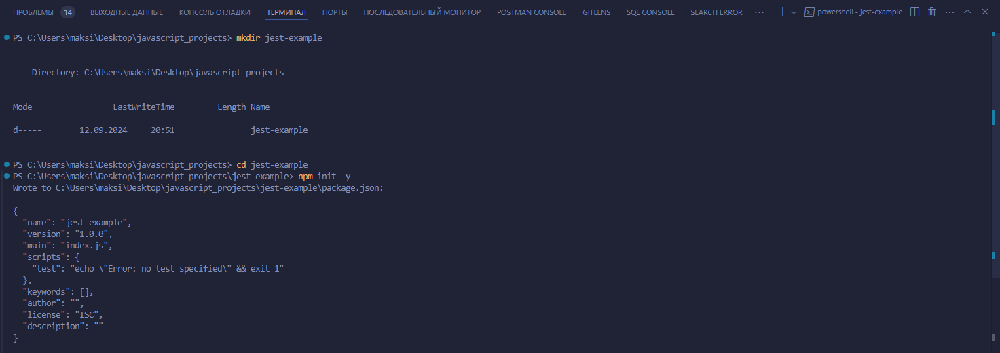
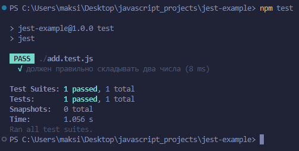

# Тестирования кода на Jest



Этот проект будет включать тестирование базовой функции сложения.

Мы создадим простой проект с одной функцией и тестом для этой функции.

### Шаг 1: Создание проекта

**Инициализируйте проект npm:**

**Откройте терминал и выполните следующие команды:**

```bash
mkdir jest-example
cd jest-example
npm init -y
```



**Установите Jest:**

```
npm install --save-dev jest
```

**Добавьте скрипт для запуска тестов в `package.json`:**

**Откройте `package.json` и измените секцию `scripts`, добавив строку "test": "jest":**

```json
{
  "name": "jest-example",
  "version": "1.0.0",
  "main": "index.js",
  "scripts": {
    "test": "jest"
  },
  "devDependencies": {
    "jest": "^29.5.0"
  }
}
```

### Шаг 2: Создание тестируемой функции

**Создайте файл с функцией `add.js`:**

**В корневом каталоге проекта создайте файл `add.js` и добавьте в него следующую функцию:**

```js
// add.js
function add(a, b) {
  return a + b;
}

module.exports = add;
```

**Создайте файл с тестами `add.test.js`:**

**В корневом каталоге создайте файл `add.test.js` и добавьте в него следующие тесты:**

```js
// add.test.js
const add = require('./add');

test('должен правильно складывать два числа', () => {
  expect(add(1, 2)).toBe(3);
  expect(add(-1, -1)).toBe(-2);
  expect(add(0, 0)).toBe(0);
  expect(add(1, -1)).toBe(0);
});
```

### Шаг 3: Запуск тестирования

**Теперь вы можете запустить тесты, используя команду:**

```bash
npm test
```



Jest выполнит тесты, и вы увидите результат в терминале.

Если все сделано правильно, тесты должны пройти успешно.

У вас есть базовый проект на Jest, который тестирует простую функцию сложения.

Вы можете расширить этот проект, добавив больше функций и тестов.


**Преподаватель:** Дуплей Максим Игоревич

**Дата:** 12.09.2024

**Версия 1.0**